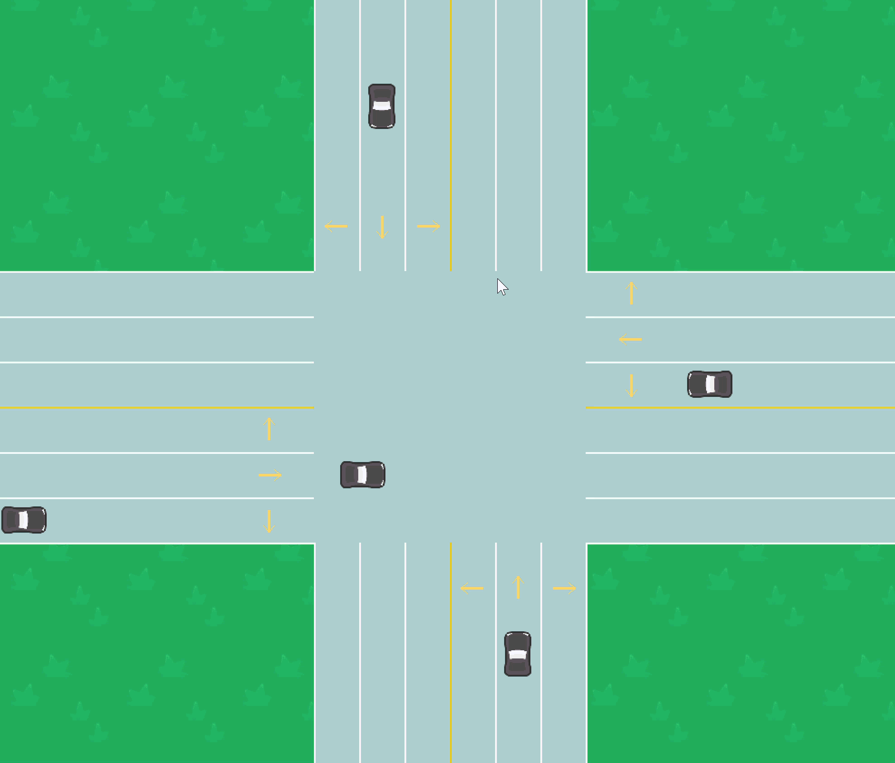
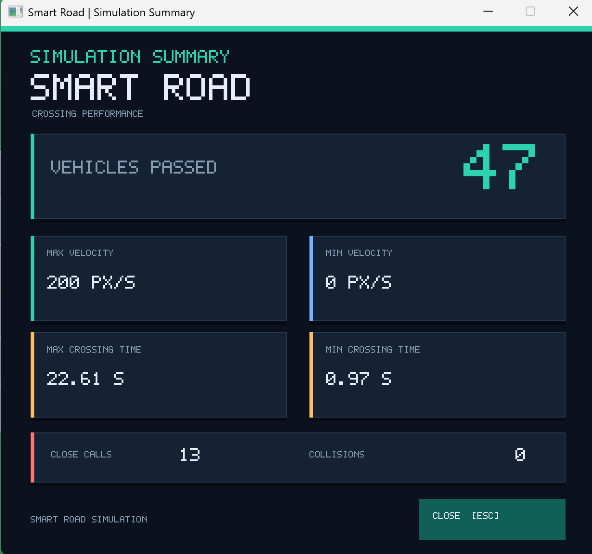

# Smart Road

Smart Road is a real-time four-way intersection simulation written in Rust with SDL2. Vehicles enter from four directions, choose routes, and use velocity control to cross without traffic lights while avoiding collisions and reducing congestion.

## Demo



## Simulation summary

Press **Esc** during a run to view the session summary, including vehicles passed, speed and crossing-time ranges, close calls, and collisions.



## Controls

| Key | Action |
| --- | --- |
| Up | Spawn a vehicle from the north |
| Down | Spawn a vehicle from the south |
| Left | Spawn a vehicle from the west |
| Right | Spawn a vehicle from the east |
| R | Toggle automatic random vehicle spawning |
| Esc | Open the statistics summary and exit the simulation |

Vehicles spawned manually are assigned a random route. Close the summary with **Esc**, **Enter**, or its close button.

## Requirements

- Rust toolchain with Cargo
- SDL2 runtime libraries

SDL2 libraries and assets are included in this repository for the configured Windows build.

## Build and run

```sh
cargo run --release
```

To build without starting the simulation:

```sh
cargo build --release
```

## Project structure

- `src/` — simulation, vehicle behavior, rendering, and statistics
- `assets/` — road tiles and vehicle sprites
- `images/` — README demo and statistics summary images
- `DESIGN.md` — simulation design decisions
- `Smart_Road_Technical_Guide.html` — technical project guide
